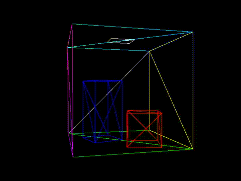

# Mini C++ Graphics Engine 

A basic 3D graphics engine implemented in C++ using SDL for window and input handling. This engine features a custom CPU-based scene rendering pipeline, supporting multiple rendering modes.

## Features:
- Object and material file parsing
- Camera Movement
- Point Cloud Rendering
- Wire Frame Rendering
- Rasterised Rendering
    - Texture Mapping
- Ray Trace Rendering
    - Texture Mapping
    - Lighting (Proximity, Angle of Incidence, Specular, Ambient)
    - Shading (Gouraud, Phong)
    - Soft Shadows
    - Reflections
    - Environment Maps
    - Normal Maps

## Example Render:


## Requirements
- CMake version 3.12+
- C++14 compatible compiler
- SDL2 (development libraries)
- GLM (included as a header-only dependency in libs/glm-0.9.7.2)

## Build Guide
1. Invoke the CMake build from the command line with either the Release or Debug build type:

```cmake -Bbuild -H. -DCMAKE_BUILD_TYPE=Release```

2. Use the makefile generated within the build directory to compile:

```cd build```  
```make```

3. Run executable generated, ensuring that your system has access to a graphical display (e.g., via X11/XServer on Linux):

```./RunEngine```